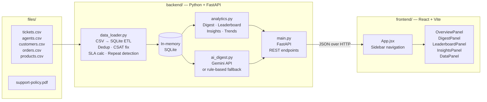

# Vireo Audio — Support Ticket Analytics

AI-assisted weekly digest and agent leaderboard for 18 months of customer support data.

## What This Is

Vireo Audio's support team handles thousands of tickets across chat, email, voice, and social channels — but nobody reads them. Priya Raman (Head of CX) asked for a **weekly digest** and an **agent leaderboard** to surface what matters each week without building a full platform.

This tool loads 18 months of ticket exports (Jan 2025 – Jun 2026) into an in-memory SQLite database, applies data cleaning rules from Vireo's support policy, and serves a React dashboard with:

- **Weekly digest** — volume, categories, channels, products, SLA breaches, CSAT, repeat contacts, and an AI-generated (or rule-based) narrative summary
- **Agent leaderboard** — tier-aware ranking: frontline by tickets resolved, Escalations & Warranty by CSAT and resolution quality
- **Insights** — repeat contact trends, SLA breach trends, CSAT distribution, inter-team transfer costs, and refund/replacement policy violations
- **Data browsers** — searchable reference views for products, customers, orders, and tickets

### Key Findings from the Data

| Metric | Value |
|--------|-------|
| Unique tickets (after dedup) | 11,875 |
| Repeat contacts | 3,871 (32.6%) |
| Top repeat category | Delivery & Shipping (780) |
| Top repeat product | Pulse 2 True Wireless Earbuds (1,082) |
| Top repeat channel | Chat (1,714 — 33.2% rate) |
| SLA breaches | 1,051 (Rs 3.7 lakh in credits) |
| Policy violations | 4 refund + replacement on same ticket |

## Quick Start

### Prerequisites
- Python 3.10+ 
- Node.js 18+
- (Optional) A Google Gemini API key for AI-powered summaries

### 1. Start the Backend

```bash
cd backend
python -m venv .venv

# Windows
.venv\Scripts\activate
# macOS/Linux
source .venv/bin/activate

pip install -r requirements.txt

# (Optional) Add your Gemini API key for AI summaries
Copy `backend/.env.example` to `backend/.env` and set `GEMINI_API_KEY` locally.

# Start the server
python -m uvicorn main:app --host 0.0.0.0 --port 8000
```

The backend loads all CSV files from the `files/` directory into an in-memory SQLite database on startup. This takes about 5 seconds.

### 2. Start the Frontend

```bash
cd frontend
npm install
# Optional: copy .env.example to .env to configure the backend URL
npm run dev
```

Open http://localhost:5173 in your browser. The frontend uses `VITE_API_BASE_URL` when set and defaults to `http://localhost:8000`.

### 3. (Optional) Add Gemini API Key

For AI-generated weekly narratives (instead of rule-based summaries):

1. Get a free API key from https://aistudio.google.com/apikey
2. Copy `backend/.env.example` to `backend/.env` and set:
   ```
   GEMINI_API_KEY=your_key_here
   ```
3. Restart the backend

Never commit or submit `backend/.env`; it must contain only a locally managed key.

## Policy Summary

The implementation uses these operating-policy rules from `support-policy.pdf`:

| Policy area | Rule used by the tool |
|---|---|
| First-response SLA | Chat 15 minutes, voice 120 minutes, social 240 minutes, email 480 minutes. |
| Contact cost | Blended support contact cost is Rs 290; transfer cost is Rs 305. |
| SLA credits | Each SLA breach is valued at a Rs 350 service credit. |
| Refunds and replacements | A ticket must not contain both a refund and a replacement; the tool surfaces these as violations. |
| Agent measurement | Frontline teams are ranked by resolved volume. Escalations & Warranty are ranked by CSAT and resolution quality, not volume. |
| CSAT | Blank and `0` scores mean no response and are excluded from averages. |
| Legacy timestamps | Negative legacy resolution durations receive the documented +5.5-hour IST correction and remain flagged. |

## Validation and Delivery

Run the deterministic validation report and backend smoke test from `backend/`:

```bash
python validation.py
python test_analytics.py
```

The validation report checks deduplication, every loaded SLA calculation, CSAT handling, every repeat-contact pair, tier classification, refund/replacement anomalies, and digest/leaderboard invariants. The current dataset produces 11,875 deduplicated tickets and 3,871 repeat contacts.

Build the frontend before recording:

```bash
cd frontend
npm install
npm run build
```

The submission materials are [memo-to-priya.md](memo-to-priya.md) and [ai-usage-disclosure.md](ai-usage-disclosure.md). Record a maximum three-minute walkthrough showing the prompts used, changes between versions, and discarded approaches. Complete the supplied submission form before sending the package.

## Architecture

The tool is a two-process stack: a **Python/FastAPI backend** that loads CSVs into SQLite and serves REST endpoints, and a **React/Vite frontend** that renders dashboards and charts via Recharts.



### File Map

```
backend/
  main.py            — FastAPI application with REST endpoints
  data_loader.py     — CSV → SQLite ETL with dedup, CSAT fix, SLA computation
  analytics.py       — Query engine for digest, leaderboard, insights
  ai_digest.py       — Gemini API integration + rule-based fallback
  validation.py      — 7-check deterministic validation suite
  test_analytics.py  — Backend smoke tests
  .env.example       — API key configuration template

frontend/
  src/
    App.jsx                    — Main shell with sidebar navigation
    api.js                     — API client with logging
    components/
      OverviewPanel.jsx        — KPI dashboard with charts
      DigestPanel.jsx          — Weekly digest with AI narrative
      LeaderboardPanel.jsx     — Tier-aware agent leaderboard
      InsightsPanel.jsx        — Repeat contacts, SLA trends, anomalies
      DataPanel.jsx            — Searchable data browser
      shared.jsx               — Hooks
      formatters.js            — Number/currency formatters
      ui.jsx                   — Loading and error components

files/                         — Source CSV data and policy documents
```

## Data Cleaning Decisions

1. **Freshdesk Duplicates**: 653 ticket IDs appear in both `helpdesk` and `legacy_fd` source systems (Sameer's migration warning). We keep the `helpdesk` version and drop the `legacy_fd` duplicate.

2. **CSAT "0"**: Per policy §8, a score of 0 means "no response" and is excluded from averages — not treated as zero.

3. **Legacy Timestamps**: 2,263 tickets have `resolved_at` before `created_at` due to the UTC→IST mismatch described in §9. These are flagged but retained, with a +5.5h correction applied.

## Quantified Business Goal

**Reduce repeat contacts from 32.6% to 25.0% within two quarters, avoiding approximately Rs 43,700 in support contact cost per quarter.**

This uses the 11,875 deduplicated tickets in the supplied 18-month export, where 3,871 repeat contacts were detected. The policy's blended contact cost is Rs 290. At the observed run rate of one quarter per six months, moving to a 25.0% repeat-contact rate would avoid about 150 contacts per quarter:

```
Current quarterly repeat contacts: 3,871 / 6 = 645.2
Target quarterly repeat contacts: 11,875 / 6 x 25.0% = 494.8
Avoided contacts per quarter: about 150
Estimated value: 150 x Rs 290 = about Rs 43,500 per quarter
```

The target is a two-quarter operating goal, not a claim that every repeat contact is preventable. The tool should be used weekly to identify the categories, products, channels, and transfer paths contributing to repeat contacts, then track whether the rate moves toward 25.0%.

## API Endpoints

| Endpoint | Description |
|---|---|
| `GET /api/overview` | Dashboard KPIs |
| `GET /api/weeks` | Available week keys |
| `GET /api/teams` | Team names |
| `GET /api/digest/{week_key}` | Weekly digest + AI summary |
| `GET /api/leaderboard?week=&team=` | Agent leaderboard |
| `GET /api/insights` | Repeat contacts, SLA trends, anomalies |
| `GET /api/trends` | Weekly volume trend data |
